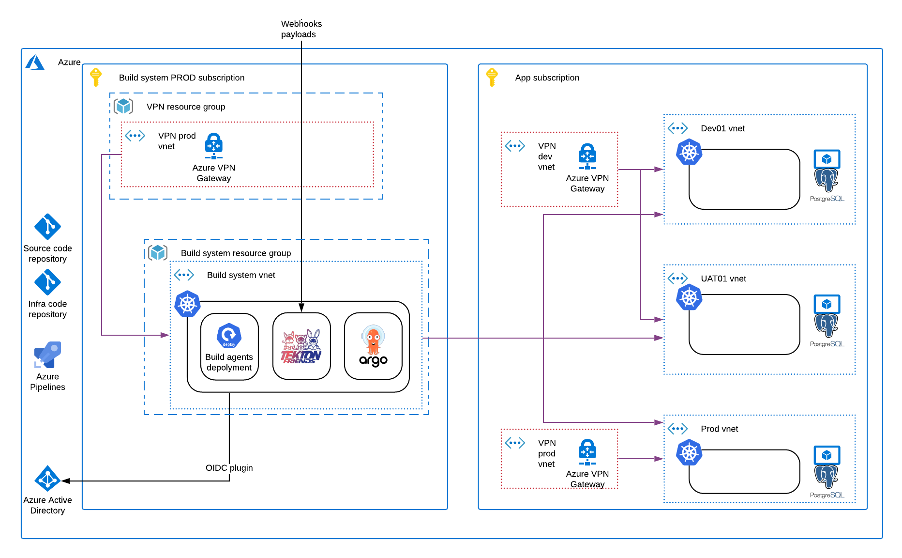

# Central Build System

## Design

We decided to go with separate tool for building (Continuous Integration) and deploying (Continuous Deployment).

For building we choose [tekton](tekton.dev), for deploying [ArgoCD](https://argoproj.github.io/argo-cd/).
You can find more information in [Design Doc](https://github.com/epiphany-platform/epiphany/pull/1243).

## Architecture diagram

### VPN VNET

This VNET is responsible for communication outside of cloud.
This means every user who wants to log in to this system has to log in to this VNET first.

Also this VNET is responsible for allowing external request - like github webhooks - to communicate with our system.

### Build system VNET

This VNET is core of build system.
In this VNET we plan to create [epiphany](https://github.com/epiphany-platform/epiphany) cluster which will use AKS (Azure Kubernetes Services).
We would like to use it because we predict that cluster will be used extensively and we want to scale the number of workers easily.
This will be easier to achieve with AKS.

### Tekton

Tekton will be installed inside Kubernetes cluster.
Access to tekton will be managed by Kubernetes RBAC.
Each group will have a separate namespace with their own UI so each team will be able to do stuff only inside their namespace.
Access control will be integrated with Azure Active Directory

### Other build agents

We also plan to allow - at least for transition period - to use other build agent.
We prepared tests and run Azure DevOps build agent on this infrastructure.
This will allow us to easier transfer user application.
In the first step we will migrate them 'as-is' and after the next step move their build process to tekton.

### ArgoCD

ArgoCD will be inside the same Kubernetes cluster.
It will be running in separate namespace with restricted access - for admins only.

Permissions for ArgoCD are managed by Argo itself.
It will be integrated with Azure Active Directory.

## Installation manual

Installation and setup instructions are covered by this [document](CBS_HOWTO.md).
